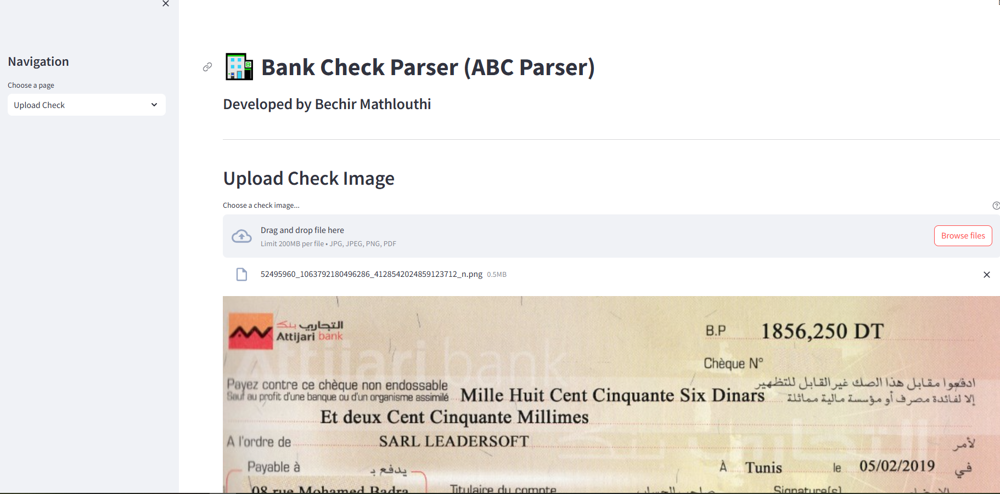
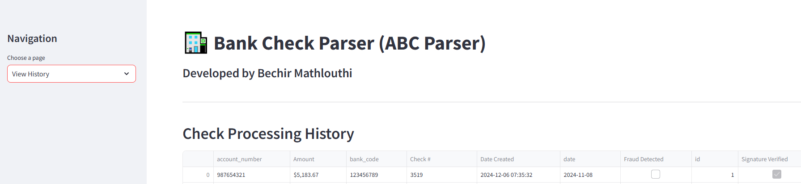

# Bank Check Parser (ABC Parser)

An intelligent system for parsing and validating bank checks using OCR and AI, developed by Bechir Mathlouthi.

## Screenshots

### Main Interface



### Processing History


## Features

- 📝 Optical Character Recognition (OCR) for check information extraction
- 🔍 Automatic detection of check fields (amount, date, account number, etc.)
- 🔒 Fraud detection and signature verification
- 📊 Check processing history and analytics
- 🌐 Modern web interface built with Streamlit
- 🚀 RESTful API built with Flask

## Technologies Used

- Python 3.9+
- Flask (Backend API)
- Streamlit (Web Interface)
- OpenCV (Image Processing)
- Tesseract OCR (Text Extraction)
- SQLite (Database)
- NumPy & Pandas (Data Processing)

## Prerequisites

- Python 3.9 or higher
- Tesseract OCR installed on your system
- Virtual environment (recommended)

## Installation

1. Clone the repository:
```bash
git clone https://github.com/Bechir-Mathlouthi/bank-check-parser.git
cd bank-check-parser
```

2. Create and activate virtual environment:
```bash
python -m venv venv
.\venv\Scripts\activate  # Windows
source venv/bin/activate  # Linux/Mac
```

3. Install required packages:
```bash
pip install -r requirements.txt
```

4. Install Tesseract OCR:
   - Windows: Download installer from [Tesseract GitHub](https://github.com/UB-Mannheim/tesseract/wiki)
   - Linux: `sudo apt-get install tesseract-ocr`
   - Mac: `brew install tesseract`

## Usage

1. Start the Flask API server:
```bash
python run.py
```

2. In a new terminal, start the Streamlit interface:
```bash
python -m streamlit run app/web/streamlit_app.py
```

3. Open your browser and navigate to:
   - Web Interface: http://localhost:8501
   - API Documentation: http://localhost:5000/api/v1/docs

## API Endpoints

- `POST /api/v1/checks/upload` - Upload and process a check image
- `GET /api/v1/checks` - Get all processed checks
- `GET /api/v1/checks/<check_id>` - Get specific check details

## Contributing

Contributions are welcome! Please feel free to submit a Pull Request.

## License

This project is licensed under the MIT License - see the [LICENSE](LICENSE) file for details.

## Author

**Bechir Mathlouthi**
- GitHub: [@Bechir-Mathlouthi](https://github.com/Bechir-Mathlouthi)

## Acknowledgments

- Thanks to the Tesseract OCR team for their amazing OCR engine
- OpenCV community for their computer vision tools
- Streamlit team for the awesome web framework
